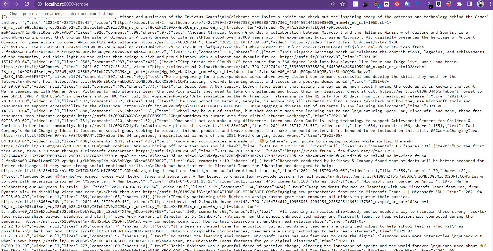

# facebook--scraper
# .A dockerized facebook scrapping service using fastAPI

 
This project is an API meant to scrape posts from Facebook public pages using either page id or page name then store the posts into a mongo-db database. The API is built using fastAPI, the Facebook scraping functionality is thanks to facebook_scraper python library, and the connection to mango-db is made by pymongo. This repository contains a requirement.txt file that contains the required python libraries needed for this project, a main.py containing the project's code, and a Dockerfile and docker-compose.ymlthat can be used to build a docker for the API.

# .Usage

$ docker compose up

This will start a container running our FastAPI application and MongoDB database. You can then access the application by going to  http://localhost:8000/scrape in your web browser.

